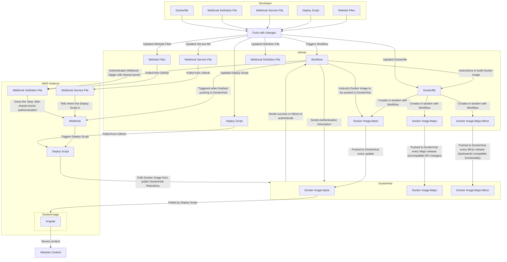

# Continuous Deployment Project Overview
* The goal of this project is to continue the development pipeline from Project 4. This project focuses on the deployment part, rather than the development part.
* Tools used in this project:
 * GitHub
   * File storage and automation
 * DockerHub
   * Docker image storage
 * AWS
   * Remote hosting
 * Webhook
   * Remote triggering
 * Angular
   * Hosts website content
 * WSL 2
   * Creates a virtual Linux enviornment for Windows users to run Linux commands.
 * Mermaid
   * Integrates diagrams into GitHub
## Diagram

## Part 1
### Generating Tags
* To see tags in a Git repo, you can run this command while inside the repo directory: ```git tag --list```
* You can also go to the repo's home page and click the ```Tags``` button under the Releases category on the right.
* To generate a tag, run ```git tag -a vX.X.X```.
* To push the tag, you can run ```git push vX.X.X```.
### Semantic Versioning Container Images with GitHub Actions
* My workflow file is [build-and-push.yml](./.github/workflows/build-and-push.yml).
* In order, the workflow file will do the following:
  * Create an Ubuntu image to run code on,
  * Pull from my repo to work on its content,
  * Authenticate to Dockerhub,
  * Build the Docker image based on the Dockerfile in the pulled repo,
  * Push the Docker image three times, one to Latest, one to vX, and one to vX.X,
  * Log out of Dockerhub,
  * Remove used files,
  * and Stop all processes.
* If the workflow file is used in a different repo, you must do the following:
  * Add DOCKER_USERNAME, DOCKER_TOKEN, and WEBHOOK_SECRET to GitHub secrets,
  * Either change line 46 to correctly identify the Dockerfile or put it in ./angular-site/,
  * and Change line 25 to your Dockerhub repo name.
### Testing & Validating
* To test that your workflow did its tasking, go over to your repo and select the Actions button above the content that is currently loaded.
* Next, click on the topmost item.
* If there is a red circle with an x in it, the workflow file has failed to complete its tasking.
  * There should be an "Annotations" section with the error inside.
* If there is a yellow spinning circle, the workflow file hasn't finished running yet.
* If there is a green circle with a check mark in it, the workflow file has completed its tasking.
* To verify that it did what you wanted it to, go to Dockerhub and check that your repo has multiple tagged versions.
* The next step is to check that the Docker image works correctly when pulled from the Dockerhub repo.
* You can run a command like this to run the Docker image: ```docker run -d -p 8080:80 --name exampleName DockerhubUsername/repoName:latest```
* Going to [http://localhost:8080](http://localhost:8080) will send you to the website content from the Docker image.
## Part 2
### EC2 Instance Details
* AMI Information: ami-0e449927258d45bc4
* Instance Type: t2.medium
* Volume size: 30 GiB
* Security Group Config:
 * Inbound: All traffic from my home IP, all traffic from WSU, and all traffic to port 9000.
 * Outbound: All traffic
* Justification:
 * Only I need to ssh into my instance and serve content to myself and to WSU for the demo, but GitHub needs to trigger my webhook. The instance also needs to serve content, so all outbound is allowed.
### Docker Setup on OS on the EC2 instance
* To install docker on Ubuntu 24.04.2 LTS, follow these steps:
 * Start by updating your package manager by using ```sudo apt update```
 * Install the dependencies by using ```sudo apt install -y apt-transport-https ca-certificates curl software-properties-common```
 * Add Docker's GPG, which allows it to sign off on packages ```curl -fsSL https://download.docker.com/linux/ubuntu/gpg | sudo gpg --dearmor -o /usr/share/keyrings/docker-archive-keyring.gpg```
 * Add the stable Docker repository to the apt manager ```echo "deb [arch=amd64 signed-by=/usr/share/keyrings/docker-archive-keyring.gpg] https://download.docker.com/linux/ubuntu $(lsb_release -cs) stable" | sudo tee /etc/apt/sources.list.d/docker.list > /dev/null```
 * Update your package manager again ```sudo apt update```
 * Install docker: ```sudo apt install -y docker-ce docker-ce-cli containerd.io```
 * Start docker: ```sudo systemctl enable docker```
 * Enable docker: ```sudo systemctl start docker```
 * Verify that docker is running: ```sudo docker --version```
 * Run ```sudo docker run hellow-world```
  * This is the package that docker uses to show that it is working correctly.
* To pull a DockerHub image, run ```docker pull username/repoName:tag```
* To run a DockerHub image, run ```docker run [flags] username/repoName:tag```
 * The flag ```-it``` is used for interactive mode, which allows you to open the container and interact with it.
  * I would recommend using this for debugging and figuring out what you need to run your programs.
 * The flad ```-d``` is used for detached mode, which makes the container run in the background.
  * I would recommend using this for containers that host content that you might need to make changes to on your host machine before restarting it.
 * The flag ```--name nameOfYourContainer``` can name the container, helping you organize them.
* To verify the container is serving content, you can do it three ways.
 * On the container: You can run ```ls /usr/share/nginx/html``` to check if there are files currently being served by nginx.
 * From the host side: You can go to [http://localhost:80](http://localhost:80) to see if it is currently hosting content.
 * From an external connection: You can go to ```http://awsIPgoesHere:80``` to check if it is currently hosting content.
* To manually refresh the container application if a new image is available on DockerHub, follow these steps:
 * Pull the new image: ```docker pull username/repoName:tag```
 * Stop the container: ```docker stop containerIdOrName```
  * You can see the id by using ```docker ps```
 * Remove the old image: ```docker rm containerIdOrName```
 * Run the new one: ```docker run [flags] username/repoName:tag```
* [My deploy script](./deployment/deploy.sh)
 * The script will output its progress, pay attention to output for testing.
### Configuring a webhook Listener on EC2 Instance
* To install adnanh's Webhook, follow these steps:
 * Install the binaries: ```wget https://github.com/adnanh/webhook/releases/download/v2.8.0/webhook-linux-amd64 -O webhook```
 * Make it executable: ```chmod +x webhook```
 * Move it to PATH: ```sudo mv webhook /usr/local/bin/```
 * Verify installation: ```webhook -v```
* The webhook definition file will adjust the behavior of webhook. Here are some useful lines:
 * id: The identifier for this webhook.
 * execute-command: What script to run when webhook is triggered.
 * command-working-directory: Where to run commands.
 * response-message: What to send back to triggerer of the webhook.
 * trigger-rule:
  * type: "value" Will only trigger the webhook if a specific value is passed to it.
  * value: The value to match
  * parameter: The header of the value to match.
* To check that your definition file was loaded, start webhook with this command: ```webhook --hooks /path/to/your/hooks.json --verbose```
 * You will see output that will tell you if your file was loaded.
* To verify that your webhook is receiving payloads that trigger it, you can simulate a payload using curl.
 * Here's an example: ```curl -X POST http://serverIpHere:9000/hooks/yourHookId```
 * If the response you get it the response-message from in your definition file, you have successfully triggered your webhook.
* To monitor the webhook logs, run: ```sudo journalctl -u webhook.service -f```
 * This will show you live output of the webhook service.
* You use ```docker logs containerId``` to check the docker logs for your container, which can show you nginx starting, HTTP access logs, etc.
* [My definition file](./deployment/hooks.json)
### Configuring a Payload Sender
* I chose GitHub to be my payload sender because I wanted my automation to be purely GitHub within workflows.
* To enable sending payloads to webhooks using GitHub, you can go to settings at the top (marked with a gear),
* Scroll down on the left bar until you see Code and Automation or Webhooks.
* Click add webhook.
* Paste this url into the Payload URL section: ```http://serverIpHere:9000/hooks/yourHookId```,
* Switch Content type to application/JSON,
* Paste your secret that corresponds with the secret in your definition file for authentication, and
* Click Add webhook.
### Configure a webhook Service on EC2 Instance
* The webhook service file (webhook.service) has three sections with multiple subsections:
 * Unit:
  * Description: Describes what the file is for.
  * After: When to start in relation to other systemd services
 * Service
  * EnviornmentFile: Loads in variables that should not be kept in the file itself.
  * ExecStart: What webhook binary to launch.
  * WorkingDirectory: The directory to run commands in.
  * User: What user to run the hook as.
  * Group: What group to run the hook as.
  * Restart: What to do after a crash.
 * Install:
  * What target to reach before automatically starting the service.
* To enable the webhook service, move the service file into the systemd directory.
 * Here's a command: ```sudo cp webhook.service /etc/systemd/system/webhook.service```
* To enable and start it, systemctl must recognize that it is there, so first run these commands:
 * ```sudo systemctl daemon-reexec```
 * ```sudo systemctl daemon-reload```
* Next, enable and start the service:
 * ```sudo systemctl enable webhook```
 * ```sudo systemctl start webhook```
* To verify that Webhook is capturing payloads and triggering our bash script, you can check webhook's status:
 * ```sudo systemctl status webhook```
* You can also simulate a webhook trigger in your terminal:
 * ```curl -X POST http://serverIpHere:9000/hooks/yourHookId```
* You can also monitor the logs from webhook:
 * ```sudo journalctl -u webhook.service -f```
* [My service file](./deployment/webhook.service)

# Resources Used
* [GitHub actions documentation](https://docs.github.com/en/actions)
* [GitHub secrets documentation](https://docs.github.com/en/actions/security-for-github-actions/security-guides/using-secrets-in-github-actions)
* [GitHub webhooks documentation](https://docs.github.com/en/webhooks)
* [Docker documentation](https://docs.docker.com)
* [Docker Hub documentation](https://docs.docker.com/docker-hub/)
* [Adnanh's Webhook documentation](https://github.com/adnanh/webhook)
* [Ubuntu documentation](https://help.ubuntu.com)
* [Mermaid documentation](https://mermaid.js.org/intro/)

## AI Used
* ChatGPT Model 4
 * "I can't install Adnanh's Webhook using the directions on their repo. Can I get your instructions?"
