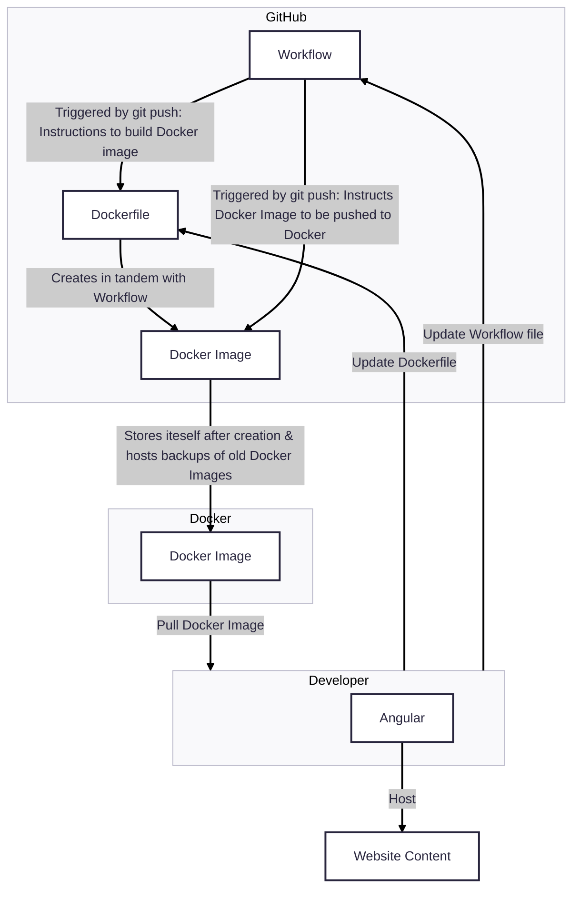

# Continuous Integration Project Overview
### Tools used in the project
* GitHub
  * Stores files, uses Actions to push images to Docker, and auto generates documentation.
* Dockerhub
  * Stores Docker images
* Docker
  * Creates/ Runs Docker images, which create virtual enviornments for programs to run inside.
* Angular
  * Hosts website content.
* WSL 2
  * Creates a virtual Linux enviornment for Windows users to run Linux commands.
* Mermaid
  * Integrates diagrams into GitHub
### Diagram

## Step 1
### Docker Setup for Windows
1. Visit the [Docker desktop site](https://www.docker.com/products/docker-desktop/) and scroll until you see "Download Docker Desktop."
2. Hover over the aformentioned button and click "Download for Windows - AMD64."
  2a. You will get a file named "Docker Desktop Installer.exe"
3. Install WSL 2 by running this command in Powershell: `wsl --install`.
  3a. For more information about installing WSL 2, visit [the official Microsoft website on installing WSL.](https://learn.microsoft.com/en-us/windows/wsl/install)
4. Double click the executable and allow the file to make changes.
5. Follow the installer's instructions and when the installer is done, click "close" to finish.
To confirm installation, start Docker Desktop and run this command in Powershell: `docker`.
   By itself, this command will show you the help page for Docker.

### Manually Setting up a Container
* The base command `docker run imageName` can be used to run a container.
#### Useful flags:
| Flag | Use |
| --- | --- |
| -p xxxx:yyyy | Maps the host's port xxxx to the container's port yyyy. Useful for checking hosted content on http, for example. |
| --name | Assigns a name to the container. Useful for managing multiple containers. |
| -d | Run detached (in the background.) |
| -l | Add a label to the container. |

#### Commands inside the container
* To install additional packages in the container (as a dependency), run this command: `npm install --save packageName`.
* To run the application in the container, first run this command: `ng serve --host 0.0.0.0 --port 3000`,
* then rebuild the application using this command: `npm run build`.

#### Verify the comtainer is serving the Angular application
* There are multiple ways:
  * In the container:
    * Checking the container logs: `docker logs containerName`
    * Checking the running processes: `docker exec containerName ps aux`
    * Verifying a response from the web server: `docker exec containerName wget -q0- localhost:3000`
    * Checking the directory structure: `docker exec containerName ls -al /app/dist`
  * On the host machine:
    * Checking the exposed port: `curl -I http://localhost:8080`
    * Checking in the browser (powershell): `Start-Process "http://localhost:8080"`
    * Verifying the container status: `docker ps -f name=containerName`

### Working with DockerHub
* To create a repo, go to [your repositories](https://hub.docker.com/repositories/).
* Next, click the "Create a repository" button and enter the relevant information.
  * Make sure not to click "Private" when on the "Create repository" menu.
* To authenticate to a DockerHub repo, it is recommended to use a Personal access token (PAT) instead of a password.
* To create a PAT, [go to DockerHub](https://hub.docker.com/) and click your profile picture in the top right.
* Next, click "Account settings" and click "Personal access tokens."
* Click "generate new token" and add the relevant information.
  * NOTE: The Personal access token will NEVER expire if you do not change the Expiration date.
  * NOTE: You cannot read any of your private repos, write to any of you repos, nor delete any repos without changing the Access permissions.
  * For this specific instance, I made it only able to Read, Write, and Delete, as I am in control of everything that happens on my computer.
* To authenticate into DockerHub, login with `docker login`. Enter your username, but NOT your password! This is what we made the PAT for.
* Instead, paste your PAT into the password slot.
* To push your container image to your DockerHub repo, we must first tag the image: `docker tag imageName yourDockerHubUsername/yourRepoName:tagName`
  * NOTE: Replace the example information with your actual information.
* Next, push the image: `docker push yourDockerHubUsername/yourRepoName:tagName`
  * NOTE: Replace the example information with your actual information.
* This will link your image to your repo.

## Step 2
### Configuring GitHub Repository Secrets
* To create a PAT, [go to DockerHub](https://hub.docker.com/) and click your profile picture in the top right.
* Next, click "Account settings" and click "Personal access tokens."
* Click "generate new token" and add the relevant information.
  * NOTE: The Personal access token will NEVER expire if you do not change the Expiration date.
  * NOTE: You cannot read any of your private repos, write to any of you repos, nor delete any repos without changing the Access permissions.
  * For this specific instance, I made it only able to Read and Write, as I do not want to delete a repo via automation ever.
* To set repository secrets, go to your repo.
* Next, go to the "Settings" tab marked with a little gear.
* This will take you to a page with a side bar that says "Secrets and variables" if you look near the bottom.
* Clicking on it will show a dropdown menu where you will click "actions."
* Click "New repository secret."
* For this project, I made two secrets: `DOCKER_USERNAME` and `DOCKER_TOKEN`, which are used for credentials for building and pushing container images to my DockerHub repository.
### CI with GitHub Actions
#### Description and Actions
* When someone pushes to main, my workflow will authenticate via `docker/login-action`, using the `DOCKER_USERNAME` and `DOCKER_TOKEN` secrets.
* Afterwards, it will use `docker/build-push-action` to build the image from the root of the repo and push two images:
  * One with the `latest` tag to indicate the most recent version.
  * One with the tag of the commit's SHA for documentation and preservation purposes.
The workflow file: [build-and-push.yml](./.github/workflows/build-and-push.yml)
The Dockerfile: [Dockerfile](./angular-site/Dockerfile)
### Testing and Validation
* To test that your workflow worked, you can go to the "Actions" tab in your repo, marked with a play button.
* If your workflow is still working, you will see a yellow light. You can watch its progress by clicking on it. If you are not interested, you can just wait.
* If it turns green, horray! The workflow completed without errors.
* To actually see if it pushed to the repo, [go to your repos.](https://hub.docker.com/repositories)
* Immediately, you should see the "Last Pushed" section on your repo says "less than a minute ago" or something else depending on how long it took you to get here.

## Resources Used
https://mermaid.js.org/intro/
https://stackoverflow.com/questions/43492354/how-to-allow-access-outside-localhost
https://dev.to/rodrigokamada/creating-and-running-an-angular-application-in-a-docker-container-40mk
https://docs.docker.com/build/ci/github-actions/
https://github.com/marketplace/actions/build-and-push-docker-images
https://docs.docker.com/reference/cli/docker/
https://docs.docker.com/get-started/docker-concepts/running-containers/publishing-ports/

## AI Resources Used
* All prompts were given to ChatGPT-4
### Prompts Used
* Please show me the structure of a Dockerfile
* Please show me the structure of a GitHub workflow file
* What are some cool things I can do with Continuous Integration with Dockerhub and GitHub?
* You mentioned Versioned, Tagged Builds. How do I do that?